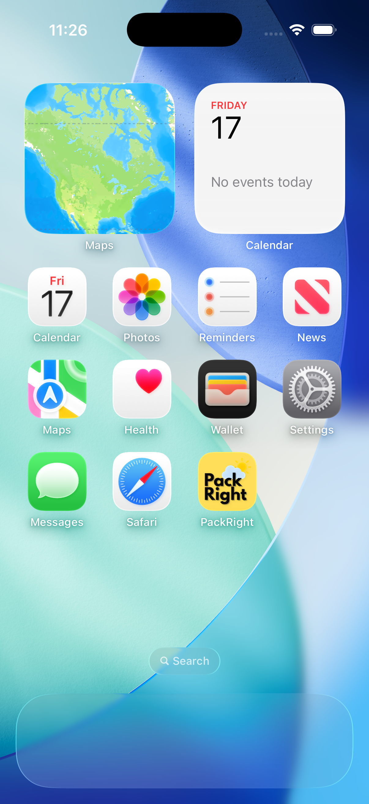
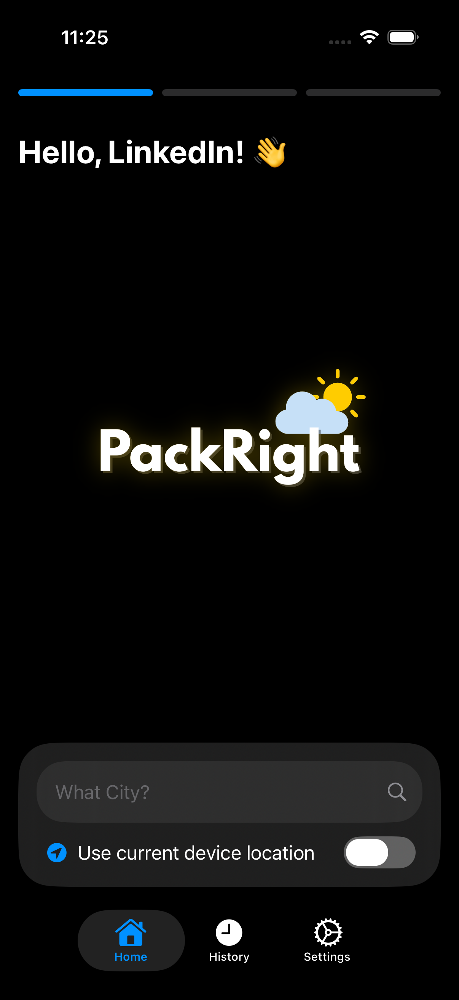

# 🧳 PackRight

  

> *An iOS app that helps you decide what to wear for your trip — built with SwiftUI, Xcode, and live weather data.*

---

## 🌦️ Overview
PackRight helps travelers plan smarter by suggesting outfit recommendations based on the weather at their destination and travel times.  
Built to explore **SwiftUI**, **API integration**, and **end-to-end iOS app development**. From UI design in **Figma** to implementation in **Xcode**.

---

## ⚙️ Features
- ⛅ **Weather API integration** – fetches real-time data to personalize outfit suggestions  
- 🎨 **Modern SwiftUI interface** – clean, responsive, and minimal UI  
- 🧠 **MVVM architecture** – separates logic from views for better scalability  
- 🧩 **Custom animations** and visual polish inspired by travel apps  
- 🧾 **Designed in Figma** – UI/UX fully prototyped before development  

---

## 🧰 Tech Stack
- **Language:** Swift  
- **Framework:** SwiftUI  
- **IDE:** Xcode  
- **Design:** Figma  
- **Architecture:** MVVM  
- **API:** OpenWeatherMap

---

## 🎬 Demo
check out the **promo ad** and live demo on my [LinkedIn](https://linkedin.com/in/ayaanfaisal) 👀  

---

## 🖼️ App Logo Preview
here’s the official **PackRight logo** used in the app icon and promo visuals:

  

---

## 📱 Homescreen UI
the **home screen** is where users pick their trip details and instantly see weather-based outfit suggestions — designed for a smooth, clean user flow:

  

---

## 🚀 Lessons Learned
this project taught me how to:
- work with **asynchronous API calls** in Swift  
- manage **state and data flow** with ViewModels  
- bring **Figma designs** to life with code  
- polish an app for real-world presentation  

---

## 🔒 License
Copyright (c) 2025 **Ayaan Faisal**  
All rights reserved.  
Unauthorized use, modification, or distribution of this software is prohibited.

---

Made with ❤️ by **Ayaan Faisal**
